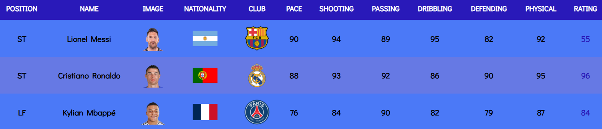

# FUT Champions Squad Builder - Backend Content Manager

## Overview
The **FUT Champions Squad Builder - Backend Content Manager** is a PHP-based web application that enables users to manage their FIFA Ultimate Team (FUT) player database. The application provides CRUD (Create, Read, Update, Delete) functionality for player records, including attributes like position, nationality, club, stats, and more.

---

## Features

1. **Add Players**
   - Input player details (name, position, nationality, club, stats, rating, and image).
   - Validate the form before submission.

2. **View Players**
   - Display a list of all players with their details and images.

3. **Edit Players**
   - Update player attributes such as position, stats, and club.

4. **Delete Players**
   - Remove a player from the database with a confirmation prompt.

5. **Responsive Design**
   - Built with TailwindCSS for a responsive and user-friendly UI.

---

## Technologies Used

- **Frontend**:
  - HTML5
  - TailwindCSS & Bootstrap
  - Custom CSS
  - JavaScript

- **Backend**:
  - PHP
  - MySQL

---

## File Structure

```
.
├── config/db_connection.php   # Handles database connection
├── editPlayers.php            # Displays the player list with edit/delete options
├── editing.php                # Form for editing player details
├── editingClub.php            # Displays the club list with edit/delete options & Form for editing club details
├── editingNationality.php     # Displays the nationality list with edit/delete options & Form for editing nationality details
├── updatePlayer.php           # Processes player updates
├── deletePlayer.php           # Handles player deletion
├── deleteClub.php             # Handles clubs deletion
├── deleteNationality.php      # Handles nationalities deletion
├── addPlayer.php              # Processes adding new players
├── addClub.php                # Processes adding new clubs
├── addNationality.php         # Processes adding new nationalities
├── dashboard.php              # Displays all details & statistics
├── index.php                  # Static user interface
├── login.php                  # Admin login page
├── logout.php                 # Confirmation logout page
├── api.php                    # API page to convert all data to a JSON form
├── script/                    # Contains JS files
├── styles/                    # Contains CSS files
├── src/img/                   # Contains images assets
└── README.md                  # Project documentation
```

---

## Installation

1. **Clone the Repository**:
   ```bash
   git clone https://github.com/your-repository/fut-squad-builder.git
   ```

2. **Setup Database**:
   - Import the `futdb.sql` file into your MySQL server.
   - Ensure the database name is `futdb` (or update `db_connection.php` accordingly).

3. **Configure PHP Environment**:
   - Use a local server like Laragon, XAMPP, or WAMP.
   - Place the project folder in the `www` or `htdocs` directory.

4. **Start the Server**:
   - Start the Apache and MySQL services.
   - Access the project at `http://localhost/fut-squad-builder`.

---

## Usage

1. **Add a Player**:
   - Navigate to the "Add Player" section.
   - Fill out the form and submit.

2. **Edit a Player**:
   - Click the ✏️ icon next to the player you want to edit.
   - Update the details and save.

3. **Delete a Player**:
   - Click the ❌ icon next to the player you want to delete.
   - Confirm the deletion prompt.

4. **View All Players**:
   - The `editPlayers.php` page displays all players with their attributes.

---

## Screenshots

### Player List


### Edit Player Form


---

## Contributions

Contributions are welcome! Feel free to fork the repository and submit a pull request.

---

## Contact

For any queries or issues, please contact:
- **Email**: ya.elhassani403@gmail.com
